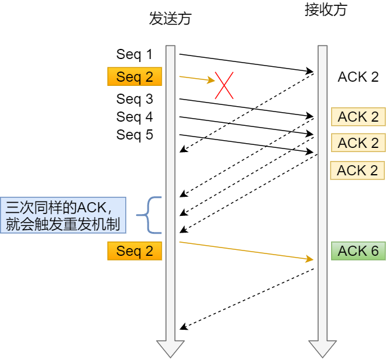

# 网络层
# 传输层
## TCP与UDP的区别
|  | TCP | UDP |
| :---: | :---:  | :---:  |
| 有无连接| 有 | 无 |
| 数据传输方式 | 字节流 | 报文段 |
| 是否可靠 | 流量控制和拥塞控制 | 没有流量控制和拥塞控制 |
| 是否有序 | 可以乱序重排 | 无序的 |
| 传输层应用 | FTP,HTTP,SMTP | DNS,TFTP,NFS |
## TCP报文结构

## 三次握手

* 客户端发送（SYN=1,seq=x）表示想要建立连接
* 服务端收到数据后返回(SYN=1,ACK=1,seq=y,ack=x+1)表示同意建立连接
* 客户端发送(ACK=1,seq=x+1,ack=y+1)表示已经接收到了回复
### 为什么三次才能建立可靠连接
  防止已过期的连接请求报文突然又传送到服务器，因而产生错误和资源浪费。
  > 双方两次握手即可建立连接的情况下，假设客户端发送 A  报文段请求建立连接，由于网络原因造成 A 暂时无法到达服务器，服务器接收不到请求报文段就不会返回确认报文段。  
    客户端在长时间得不到应答的情况下重新发送请求报文段 B，这次 B 顺利到达服务器，服务器随即返回确认报文并进入 ESTABLISHED 状态，客户端在收到 确认报文后也进入 ESTABLISHED 状态，双方建立连接并传输数据，之后正常断开连接。  
    此时姗姗来迟的 A 报文段才到达服务器，服务器随即返回确认报文并进入 ESTABLISHED 状态，但是已经进入 CLOSED 状态的客户端无法再接受确认报文段，更无法进入 ESTABLISHED 状态，这将导致服务器长时间单方面等待，造成资源浪费。 
### 三次握手到底确认了什么信息
1. 第一次握手：客户端只是发送处请求报文段，什么都无法确认，而服务器可以确认自己的接收能力和对方的发送能力正常；

2. 第二次握手：客户端可以确认自己发送能力和接收能力正常，对方发送能力和接收能力正常；

3. 第三次握手：服务器可以确认自己发送能力和接收能力正常，对方发送能力和接收能力正常； 
 
这也是为什么需要三次握手而不是两次的原因。
### 三次握手连接阶段，最后一次ACK包丢失，会发生什么
服务端：

* 第三次的ACK在网络中丢失，那么服务端该TCP连接的状态为SYN_RECV,并且会根据 TCP的超时重传机制，会等待3秒、6秒、12秒后重新发送SYN+ACK包，以便客户端重新发送ACK包。
* 如果重发指定次数之后，仍然未收到 客户端的ACK应答，那么一段时间后，服务端自动关闭这个连接。
 
客户端： 

  * 客户端认为这个连接已经建立，如果客户端向服务端发送数据，服务端将以RST包（Reset，标示复位，用于异常的关闭连接）响应。此时，客户端知道第三次握手失败。
## 四次挥手

  * 客户端发送(FIN=1, seq=x)表示想断开连接
  * 服务端收到报文，发送(FIN=1, ACK=1, seq=y, ack=x+1)表示同意断开，此时客户端到服务端不能再发送数据。
  * 服务端将没有发送完成的数据向客户端发送完成之后，发送(FIN=1, seq=y+a, ack=x+1)表示服务端想断开连接
  * 客户端收到后,发送(ACK=1, seq=x+1, ack=y+a+1)表示同意断开，等待 2*MSL（最长报文段寿命）的时间后，客户端才释放连接
### 为什么客户端的TIME-WAIT 状态必须等待2MSL
因为在发送完确认断开后(ACK=1), 此时需要确保服务端收到了自己发送的确认断开的报文，如果服务端没收到还要确保能收到服务端重发的请求断开报文(FIN=1, ACK=1)。因此，等待时间要大于等于确认断开报文的最大存活时间 + 服务端重发的请求断开报文(FIN=1, ACK=1)的最大存活时间 = 2MSL。  
另一个作用可以保证本连接持续的时间内产生的所有报文段都从网络中消失。
### TIME_WAIT 是服务器端的状态?还是客户端的状态
TIME_WAIT是首先发送请求断开报文一端的状态，一般情况下都是客户端，因为通常服务端不主动断开。
## TCP如何接收数据？滑动窗口机制
实现了一种乱序发送，即前面的数据段即使没有应答也可以现发送后面的数据段。

* SND.WND：表示发送窗口的大小（大小是由接收方指定的）；

* SND.UNA：是一个绝对指针，它指向的是已发送但未收到确认的第一个字节的序列号，也就是 #2 的第一个字节。

* SND.NXT：也是一个绝对指针，它指向未发送但可发送范围的第一个字节的序列号，也就是 #3 的第一个字节。

* 指向 #4 的第一个字节是个相对指针，它需要 SND.UNA 指针加上 SND.WND 大小的偏移量，就可以指向 #4 的第一个字节了。
## 基于滑动窗口的流量控制
流量控制是为了让发送方根据接收方的接收能力控制发送数据量的机制，发送方根据接收方ACK包中的window字段动态调整窗口。
几个问题：
  * 窗口收缩导致的丢包
    > 接收方收缩窗口，发送ACK300, windows100包。在包到达发送方之前，发送方如果已经发送了200字节的数据，而此时接收方的窗口已经收缩到了100字节，那么另外的100字节数据就会丢失。这是因为窗口实际上是开辟的一段缓存，如果先减少缓存，再收缩窗口(发送收缩窗口的包)，就会出现丢包的现象。  
    因此TCP 规定是不允许同时减少缓存又收缩窗口的，而是采用先收缩窗口，过段时间再减少缓存，这样就可以避免了丢包情况。
  * 窗口为0导致的死锁
    > 如果窗口大小为 0 时，就会阻止发送方给接收方传递数据，直到窗口变为非 0 为止，这就是窗口关闭。此时如果接收方想要恢复窗口就会发送，ACK100，window100的包。如果恢复包丢失，那么就会出现发送端等待恢复，接收端以为已经恢复等待数据传输的死锁状态。  
    为了解决这个问题，TCP 为每个连接设有一个持续定时器，只要 TCP 连接一方收到对方的零窗口通知，就启动持续计时器。
    如果持续计时器超时，就会发送窗口探测 ( Window probe ) 报文，而对方在确认这个探测报文时，给出自己现在的接收窗口大小。
  * 避免发送小窗口
    > TCP的头部字段至少为40个字节，如果发送数据量过少例如只有2字节，效率大大下降。为了解决这个问题接收方与发送方都会有相应的控制。    
    接收方：当「窗口大小」小于 min( MSS，缓存空间/2 ) ，也就是小于 MSS 与 1/2 缓存大小中的最小值时，就会向发送方通告窗口为 0，也就阻止了发送方再发数据过来。
    等到接收方处理了一些数据后，窗口大小 >= MSS，或者接收方缓存空间有一半可以使用，就可以把窗口打开让发送方发送数据过来。  
    发送方：使用 Nagle 算法，该算法的思路是延时处理，它满足以下两个条件才可以发送数据：    
    1.要等到窗口大小 >= MSS 或是 数据大小 >= MSS    
    2.收到之前发送数据的 ack 回包
        
    
    
## 基于滑动窗口的拥塞控制
拥塞控制是为了让发送方根据网络情况调整发送数据量的机制
* 慢启动  
   当发送方每收到一个ACK
   ，拥塞窗口 cwnd
    的大小就会加 1。当达到慢启动门限ssthresh时转为拥塞避免。
* 拥塞避免  
  每当收到一个 ACK
    时，cwnd 增加 1/cwnd
   
* 拥塞发生  
  发生重传时转为拥塞发生。不同的重传处理也不同
  * 超时重传  
    ssthresh 设为 cwnd/2，cwnd 重置为 1。转为慢启动
  * 快速重传  
    cwnd = cwnd/2，ssthresh = cwnd。转为快速恢复。这里ssthresh保存了快速恢复之前的cwnd值方便后面直接恢复。
* 快速恢复
  * 拥塞窗口 cwnd = ssthresh + 3 （ 3 的意思是确认有 3 个数据包被收到了）；
  重传丢失的数据包；  
  * 如果再收到重复的 ACK，那么 cwnd 增加 1；  
  * 如果收到新数据的 ACK 后，把 cwnd 设置为第一步中的 ssthresh 的值（上面已经保存了），原因是该 ACK 确认了新的数据，说明从 duplicated ACK 时的数据都已收到，该恢复过程已经结束，可以回到恢复之前的状态了，也即再次进入拥塞避免状态
## 丢包怎么办？TCP超时重传
当网络中发生丢包时，TCP为了保证数据的完整性规定了重传机制。
* 超时重传  
  顾名思义，超出一定时间没有收到ACK包后就会重发数据，通常重传时间RTO是动态变化的。如果超时后再次超时，RTO会设置为之前的两倍。
* 快速重传  
  超时重传周期比较长，因此有了快速重传。当发送方收到连续三个相同ACK时，会重发数据。接收发送均使用滑动窗口
    
  例如seq2丢失，seq1成功接收，接收方无论收到什么数据都会发送ACK2，当重复三次后发送方就知道seq2丢失了，进行重发。此时还有一个问题，即发送方是重发seq2，seq3，seq4，seq5，还是仅重发seq2？
## 重传哪些包怎么确定？
解决需要重发哪些包的问题，与重发机制并不冲突。
* 选择性确认SACK
 
 在TCP头部添加一个SACK字段，当200-299包丢失后，ACK仍为200，SACK表示一系列的非连续的没有确认的数据的seq range。重传机制会在收到连续三个ACK200后选择重传，此时根据ACK200，SACK300-600，发送方得知300-600已经接收了，200-300段丢失了，只重传这一部分就可以了
* 重复选择确认D-SACK  
  使用的还是SACK字段，目的是用 SACK 来告诉「发送方」有哪些数据被重复接收了，防止发送方多次重发。
  ACK丢包：
  
  网络延时：
  

# 应用层
## HTTP协议
HTTP的状态码
* 1xx  
  信息性状态码
* 2xx  
  成功状态码
* 3xx  
  重定向状态码
  * 301 永久移动, 服务器会自动转到新的地址
  * 302 临时移动，旧地址的资源还在，这个重定向只是临时地从旧地址A跳转到地址B
* 4xx  
  表示客户端错误 
  * 404 请求的资源不存在
  * 400 请求有语法错误
* 5xx  
表示服务端错误 
   * 500 服务器遇到错误，无法完成请求

幂等性原则  
&emsp;即发送多次请求与发送一次请求的结果是一样的。   
HTTP长连接与短连接（TCP长连接与短连接）  
&emsp;HTTP/1.0中，默认使用的是短连接  
&emsp;HTTP/1.1起，默认使用长连接，使用长连接的HTTP协议，会在响应头有加入这行代码：Connection:keep-alive
### HTTP与HTTPS
| | HTTP | HTTPS |
| :--: | :--: | :--: |
| 端口 | 80 | 433 |
| 安全性 | 不加密 | 加密，需要证书 |
| 协议 | 直接在TCP协议之上 | 运行在SSL协议之上，SSL协议基于TCP|
### 在浏览器中输入www.xxx.com后执行的全部过程
1. 使用DNS协议查询域名对应的ip地址。首先在浏览器的DNS缓存查，而后在操作系统的DNS缓存查，再在操作系统的Host文件查。都查不到，就利用DNS服务器进行递归查询。
2. 建立TCP连接(三次握手)浏览器会以一个随机端口（1024-65535）向服务端的 web 程序 80 端口发起 tcp 的连接
3. 发送HTTP请求进行通信

### session与cookie的区别
| | cookie | session |
| :--: | :--: | :--: |
|存储位置 | 客户端 | 服务端
| 有效期|  可以长时间有效 | 通常客户端关闭就失效| 
| 存储大小 | 不能超过4k | 通常没有具体的限制 |
| 存储的数据 | 只能保存 ASCII | 可以存任意数据类型，比如UserId等 |  

一个session与cookie协同工作的场景:  
&emsp; 用户登录成功后，服务端生成一个sessionID字段返回给客户端。客户端将sessionID保存在本地cookie中，在第二次请求的时候，将cookie一并发送给服务端。服务端会查找cookie中有没有sessionID字段。再根据 SessionID 查找对应的 Session 信息

### 基于session的用户认证方式与基于token的用户认证方式
&emsp; JWT与Session最大的区别就是保存位置不同。这也是JWT与Session优缺点的核心。  

JWT由于保存在客户端，带来几个优点。  
1. 可扩展性好。分布式的场景下，session需要解决多个服务端的session一致性问题。而JWT不需要。  
2. JWT无状态。JWT不在服务端存储任何状态。RESTful API的原则之一是无状态，发出请求时，总会返回带有参数的响应，不会产生附加影响。用户的认证状态引入这种附加影响，这破坏了这一原则。
 
缺点:   
1. 无法废弃。一旦签发一个jwt，在到期之前就会始终有效，无法中途废弃。
> 例如你在payload中存储了一些信息，当信息需要更新时，则重新签发一个jwt，但是由于旧的jwt还没过期，拿着这个旧的jwt依旧可以登录，那登录后服务端从jwt中拿到的信息就是过时的。为了解决这个问题，我们就需要在服务端部署额外的逻辑，例如设置一个黑名单，一旦签发了新的jwt，那么旧的就加入黑名单（比如存到redis里面），避免被再次使用。  
> 如果你使用jwt做会话管理，传统的cookie续签方案一般都是框架自带的，session有效期30分钟，30分钟内如果有访问，有效期被刷新至30分钟。一样的道理，要改变jwt的有效时间，就要签发新的jwt。最简单的一种方式是每次请求刷新jwt，即每个http请求都返回一个新的jwt。这个方法不仅暴力不优雅，而且每次请求都要做jwt的加密解密，会带来性能问题。另一种方法是在redis中单独为每个jwt设置过期时间，每次访问时刷新jwt的过期时间。
2. jwt太长影响性能。
 > 由于是无状态使用JWT，所有的数据都被放到JWT里，如果还要进行一些数据交换，那载荷会更大，经过编码之后导致jwt非常长，cookie的限制大小一般是4k，cookie很可能放不下，所以jwt一般放在local storage里面。并且用户在系统中的每一次http请求都会把jwt携带在Header里面，http请求的Header可能比Body还要大。而sessionId只是很短的一个字符串，因此使用jwt的http请求比使用session的开销大得多。 
 ### 分布式session的处理
 多服务器导致的session一致性问题。解决方案  
  *  客户端存储，类似JWT的解决方式。
  *  ip_hash 策略， 将每个IP按照一定的方式进行哈希，那么每个IP访问的后端服务器是固定的。避免了在服务器 A 创建 Session，第二次分发到服务器 B 的现象
  *  Session 复制， 任何一个服务器上的 Session 发生改变（增删改），该节点会把这个 Session 的所有内容序列化，然后广播给所有其它节点。
  *  共享session ，将用户的 Session 等信息使用缓存中间件（如Redis）来统一管理，保障分发到每一个服务器的响应结果都一致。
    
### JWT介绍
一个jwt实际上就是一个字符串，它由三部分组成，头部、载荷与签名，这三个部分都是json格式。
 * 头部 描述JWT的基本信息，例如类型，采用的加密算法
 * 载荷 可以保存一些交互用到的数据。
 * 签名 对头部+载荷+自定义的密钥进行加密后的字符串  
  
如何拼接  
&emsp; 头部和载荷分别进行Base64编码之后得到两个字符串，然后再将这两个编码后的字符串用英文句号.连接在一起（头部在前）。  
&emsp;将上面拼接完的字符串用HS256算法进行加密。在加密的时候，我们还需要提供一个密钥（secret）。加密后的内容也是一个字符串，最后这个字符串就是签名，把这个签名拼接在刚才的字符串后面就能得到完整的jwt
