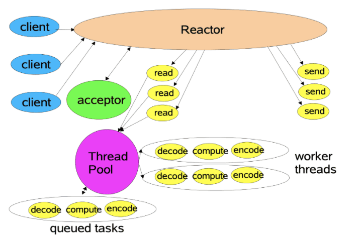

# IO模型
unix IO中IO过程分为两个阶段，第一阶段是等待数据就绪(网络场景下是等待数据包，非网络场景下是将数据从外存拷贝到系统内核空间的内存)。第二阶段是将数据从内核内存拷贝到用户进程内存中。根据不同阶段的不同阻塞情况将IO分为5种

 * 阻塞式IO  
   最简单的IO形式，用户进程一直阻塞(调用recvfrom系统调用)，直到第一阶段和第二阶段都完成，这期间只会调用一个系统命令。
   
 * 非阻塞式IO  
    在第一阶段数据没准备好时，系统会立刻返回一个状态码告诉用户进程数据没准备好，而不是阻塞。但是通常用户进程会继续执行系统调用询问系统数据是否准备好。(没明白这种非阻塞式有什么意义)
    
 * IO复用  
    能够使得一个系统进程处理多个IO资源。用户进程还是阻塞，只不过阻塞的系统调用由recvfrom变成了select/poll/epoll。等到资源可用时，用户进程再调用recvfrom将资源复制到用户进程的内存中。唯一的好处就是一个进程能够监视多个资源 
    
 * 信号驱动  
    类似信号量机制，第一阶段立即返回，不用阻塞也不用轮询，资源就绪后调用recvfrom。网上资料说这种方式很少使用不知道为什么 
    

 * 异步IO  
    两阶段都不阻塞，异步 I/O 与信号驱动 I/O 的区别在于，异步 I/O 的信号是通知应用进程 I/O 完成，也就是一阶段非阻塞与两阶段非阻塞的区别
    
所有IO模型的对比

# Reactor模型
Reactor模型是基于时间驱动的并发模型。一个网络请求包含监听连接、建立连接、监听事件、处理事件、写回数据。
## 单Reactor单线程版本
redis使用了这种方式。所有流程都在一个线程内。
* Reactor中的acceptor负责监听连接（使用非阻塞的IO和事件驱动的模式）。处理连接的建立过程，包括接受连接、初始化配置。在有新的连接请求到达时通知主 Reactor。
* 在建立连接以后，如果连接有事件，Reactor会得到acceptor的通知，而后将事件分发给对应的handler进行处理。
* 由handler负责完成读入 ---> 处理数据（业务计算） ---> 写回
    
 
问题：
 * 这种模式还是单线程的，上述流程都在一个线程内完成，一旦Reactor线程意外中断或者进入死循环，会导致整个系统通信模块不可用。
 * 单线程的处理性能一般。
  
## 单Reactor多线程版本
业务与IO分离，引入线程池处理业务逻辑。
  * 单线程版本的区别就是handler不在负责处理业务数据，而是将业务逻辑分发给worker线程池中的线程处理。handler只负责收发请求和结果。
    
## 主从Reactor多线程版本
进一步将IO读写阶段使用并发的线程池，将Reactor分为主从两部分。主Reactor负责监听和管理连接。从Reactor负责处理读写事件，将业务分发给work线程。
* 主Reactor线程池中选一个作为acceptor负责监听建立连接。
* 连接建立后分发给从Reactor。（通过多路复用器不停循环的事件，将连接作为事件注册一下，那么从Reactor的多路复用器就能轮询到）
* 当有读写事件时从Reactor会调用Handler线程进行响应
* Handler仍然只负责读写数据，具体业务计算由work线程进行。

# java中的IO