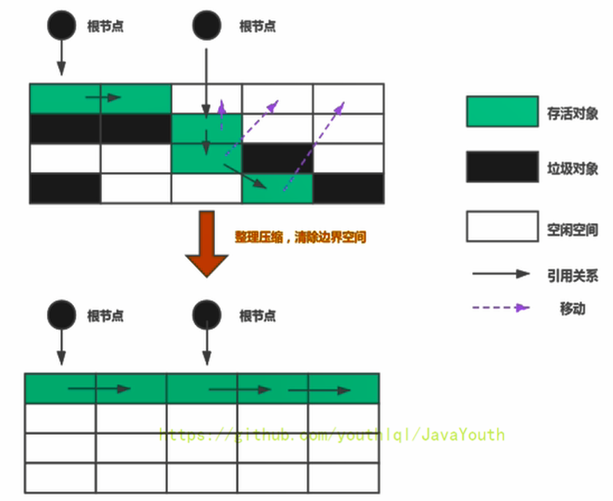
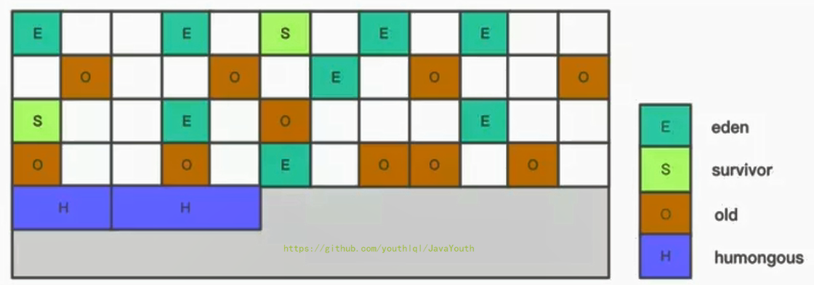

# 垃圾回收算法
垃圾回收整体分为两阶段进行，首先标记哪些对象为垃圾对象(没有被引用)，而后清除垃圾。
## 第一阶段：标记
 * 引用计数算法
    > 为每个对象保存一个引用计数器。每当A对象引用B对象时，就在B对象的引用计数器上加一。
    * 优点：效率高，实现简单。 
    * 缺点
      * 增加了存储开销
      * 最核心的问题是无法判断循环引用的问题。
 * 可达性分析算法
    > GCRoots,根集合。一组必须活跃的对象集合，即不会成为垃圾。例如：  
    &emsp; 虚拟机栈中的局部对象。  
    &emsp; 本地方法栈中的对象。  
    &emsp; 方法区中类的静态属性所引用的对象。  
    &emsp; 所有被同步锁synchronized持有的对象。  
    &emsp; java虚拟机内部的引用，例如基本数据类型对应的Class对象，一些常驻的异常对象（NullPointerException、OutofMemoryError），系统类加载器。  
    &emsp; 在不同的垃圾收集器中，一些对象会被临时加入GCRoots中。例如，G1进行youngGC时，会将Remember Set中的对象加入GCRoots（后文会详细介绍）。再比如，分代收集时，如果只针对年轻代GC，那么一些老年代的对象也要被加入GCRoots。
      
## 第二阶段：清除
 * 标记清除  
    标记非垃圾对象，然后将没有标记的对象全部清除（加入空闲内存列表）。
    
    缺点: 碎片化比较严重
 * 复制算法  
    将内存分为两个区域，每次将非垃圾对象直接复制到另一个区域。解决了碎片化的问题。
    
    缺点：需要两倍空间，空间利用率低。同时不适合垃圾较少的区域，因为需要复制存活的对象。因此经常用作新生代的回收，而较少用于老年代。
 * 标记压缩   
    先标记非垃圾对象，而后清除的时候将所有对象复制到内存的一端，按顺序排放
    
    缺点：效率低于前两种，因为既要标记又要移动。并且，移动的时候如果被移动对象被其他对象引用，那么就需要更改其他对象的引用地址。
    
# 垃圾收集器
## 卡表、记忆集与写屏障
### 记忆集
记忆集主要用于区域回收或分代回收(分代回收本质上也是区域回收，因为新生代和老年代物理上就是不同的内存区域)。
  > &emsp; 对于局部的区域来说，当某个对象有外部区域引用时，局部区域内的该对象不应该被回收。例如A在新生代，B在老年代。B引用了A，而此时只针对新生代进行GC。如果按照常规的GCRoots定义，A很可能不能够加入GCRoots里面，也就导致B被标记为垃圾。除非每次收集都进行全堆扫描。
  
因此，针对这个问题，如果能够记录跨区域的引用，就避免了每次都进行全堆扫描。记录这个跨区域引用的数据结构就是记忆集。
### 卡表
 * 卡表的基本思想是将堆内存分割成一系列固定大小的区域，每个区域称为一个卡片（Card）。卡表通常是一个大小与堆内存相等的二维数组，其中的每个元素对应一个卡片。卡片的大小通常是几十个字节到几百个字节，具体取决于具体的实现和系统架构。HotSpot中使用的是卡片是2的9次幂，即512字节。  
 * 卡表的目的是跟踪堆内存中的引用变更情况。当对一个对象引用进行写操作时（对象引用改变），写屏障逻辑将会标记对象所在的卡页为dirty。

## 卡表与记忆集的关系
卡表可以作为记忆集的一种实现手段。
> CMS利用卡表实现了记忆集（主要是记录新生代与老年代之间的引用），如果卡片所表示的区域含有当前GC区域的引用，则卡片会有一个标志位变为1。
 
## 写屏障
写屏障是对卡表和记忆集修改的操作。也就是说JVM通过写屏障来维护卡表与记忆集。分为几个阶段：  
 * 拦截 当对对象的引用字段进行修改时，会拦截这个操作。例：A.ref = oldObj; A.ref = newObj;
 * 记录变更 写屏障将变更记录下来，即原来所引用对象的地址，例: oldObj的地址。
 * 修改 更新卡表、记忆集等相关数据结构。
 * 完成写操作 将新引用写入目标字段。
## 垃圾收集器的评价指标
* 吞吐量 &emsp;  运行用户线程的时间 / (用户线程 + GC线程的总时间)
* STW时延 &emsp; 执行垃圾收集时，用户程序的工作线程被暂停的时间。
* 内存占用    
## 常见的垃圾收集器 
* Serial与Serial Old  
    > &emsp; serial只针对新生代，采用复制算法。serial old只针对老年代，采用标记压缩算法。  
    >&emsp;  serial系列在回收时，采用单线程，且无并发的方式。
* ParNew/Parallel Scavenge与Parallel old（下文简称为PN，PS，PO）
    >&emsp; PN和PS针对的收集区域一样，都是新生代。PS与PO的机制一样，针对吞吐量优化，进而有自适应调节策略（动态调整内存分配情况）。  
    &emsp; 采用的收集算法都与serial系列一致。
* CMS（Concurrent-Mark-Sweep）
    > &emsp; 首次引入并发的垃圾收集器。只针对老年代    
    > &emsp; 目的是尽可能减低延迟（STW）的时间。采用标记清除算法JDK1.5中与PN或者Serial配合使用。  
    >&emsp; CMS收集器不能像其他收集器那样等到老年代几乎完全被填满了再进行收集，而是当堆内存使用率达到某一阈值时，便开始进行回收。如果回收过程中出现内存不足以支持CMS运行的情况，便会使用备用的回收器Serial old进行回收。

    

    回收分为四个阶段。
    * 初始标记，会STW。  
        仅标记GCRoots中的直接关联对象。因此时延很短。A引用B，B引用C。这个阶段只会标记B。C不会被标记。目的是快速找到需要分析的引用链的头部。  
    * 并发标记，不会STW。  
        并发的寻找所有可达对象，这个过程是最耗时的，但是会并发执行，因此并不影响用户线程执行。
    * 重新标记，会STW。  
        由于并发阶段用户线程也在执行，因此会发生一下引用上的变化，这一阶段必须STW，才能保证可达性分析的正确性。（利用卡表和记忆集）基本只遍历发生变动的那一部分。
        > &emsp;卡表的基本思想是将堆内存分割成一系列固定大小的区域，每个区域称为一个卡片（Card）。卡表通常是一个大小与堆内存相等的二维数组，其中的每个元素对应一个卡片。卡片的大小通常是几十个字节到几百个字节，具体取决于具体的实现和系统架构。  
        &emsp;在并发标记期间，CMS会记录引用关系发生变更的卡片（标记为Dirty Card）。在重新标记阶段，CMS只需要扫描这些发生变更的卡片。
    * 并发清除，不会STW。  
        不需要移动存活对象，所以这个阶段也是可以与用户线程同时并发的

    > CMS的缺点 :  
     采用标记清除，因此有碎片。  
     并发阶段会导致用户线程性能下降。
     
            
* G First（G1）  
 延迟可控的情况下获得尽可能高的吞吐量。最重要的是提出了内存分区收集。（region）
  * 分区算法  
    > 将java堆分为2048个region，每个region为1M到32M之间为2的N次幂。每个region大小相同且在jvm生命周期内不会改变。    
    仍然将内存逻辑上分为新生代老年代，但是并非物理上的连续。整体分为四类，eden ，survivor，old，humngous（用于存放大对象）。每个region只能属于一类。
    
    为什么有H区？
    对于堆中的大对象，默认直接会被分配到老年代，但是如果它是一个短期存在的大对象就会对垃圾收集器造成负面影响。为了解决这个问题，G1划分了一个Humongous区，它用来专门存放大对象。如果一个H区装不下一个大对象，那么G1会寻找连续的H区来存储。为了能找到连续的H区，有时候不得不启动Full GC。G1的大多数行为都把H区作为老年代的一部分来看待。
   * 回收过程  
     采用复制算法和标记整理算法，region之间是复制，整体看是标记整理  
     *  年轻代GC  
        只回收eden region和survivor region。采用复制算法，将存活的对象放的新的s区，而新的s区的位置采用标记整理算法，在内存顺序的第一个空闲位置。
        
     *  并发标记  
        1. 初始标记阶段：标记从根节点直接可达的对象。这个阶段是STW的，并且会触发一次年轻代GC。正是由于该阶段时STW的，所以我们只扫描根节点可达的对象，以节省时间。
        2. 根区域扫描（Root Region Scanning）：G1 GC扫描Survivor区直接可达的老年代区域对象，并标记被引用的对象。这一过程必须在Young GC之前完成，因为Young GC会使用复制算法对Survivor区进行GC。
        3. 并发标记（Concurrent Marking）：
        在整个堆中进行并发标记（和应用程序并发执行），此过程可能被Young GC中断。
        在并发标记阶段，若发现区域对象中的所有对象都是垃圾，那这个区域会被立即回收。
        同时，并发标记过程中，会计算每个区域的对象活性（区域中存活对象的比例）。
        4. 再次标记（Remark）：由于应用程序持续进行，需要修正上一次的标记结果。是STW的。G1中采用了比CMS更快的原始快照算法：Snapshot-At-The-Beginning（SATB）。
        5. 独占清理（cleanup，STW）：计算各个区域的存活对象和GC回收比例，并进行排序，识别可以混合回收的区域。为下阶段做铺垫。是STW的。这个阶段并不会实际上去做垃圾的收集
        并发清理阶段：识别并清理完全空闲的区域。
      * 混合回收  
        > 进行young GC加上部分old GC  
        并发标记结束以后，老年代中百分百为垃圾的内存分段被回收了，部分为垃圾的内存分段被计算了出来。默认情况下，这些老年代的region会分8段，每次回收收垃圾多的内存分段，且垃圾要达到分段的65%。
      * Full GC  
           前面的方式都不能正常工作后出发Full GC。G1的目的就是避免Full GC，因此出现Full GC后要进行优化。