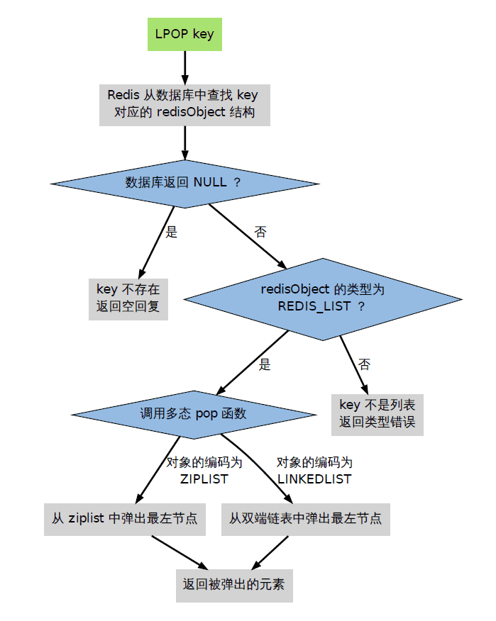

# 5种基本数据类型
redis中的所有数据都有kv两部分，讨论redis数据类型时通常都是讨论value的类型。因为key的类型都是字符串
 * String  
    基本命令,：set、get、del、incr(值自增1)、decr(值自减1)、incrby(值增加一个整数)、decrby(值减去整数)
 * List  
    基本命令：Rpush、Rpop、Lpush、Lpop、Lrange、Lindex
 * Set  
    基本命令：Sadd、Scard(获取集合的长度)、Smembers(获取集合中的所有成员)、Sismember(判断是否是集合的成员)
 * Hash  
    基本命令：Hset、Hget、Hdel、Hgetall
 * Zset  
    基本命令：Zadd、Zrange、Zrem、
# 三种特殊数据类型
 * HyperLogLogs  
    用于统计一个集合中的基数，按照概率算法进行计算，因此会有小概率发生误差。
 * Bitmap  
    位图数据结构，可以使用bit表示一些涵义来节省空间。例如用户每天登录与否可以用bitmap存储。那么365 天 = 365 bit 1字节 = 8bit 只需要 46 个字节左右。
 * Geospatial    
    地理位置信息
# Redis对象机制(RedisObject)
## 为什么会有RedisObject对象这种机制
Redis的命令分为两种，公用的命令如：DEl、TYPE等命令。另外一些是与类型强关联的命令，如：Lpush、Lpop、Hset等。因此，<font color=0ffff0>redis必须让键值保存类型信息，一遍能够对键值进行类型检查。</font>另外，对一些公用的命令，如果底层数据结构不同，那么对底层数据结构的操作也不同，因此，<font color=0ffff0>redis必须实现命令的多态性：根据底层数据结构类型的不同实现不同的操作。</font>
## RedisObjcet的数据结构
```C
 typedef struct redisObject{
    // 类型信息
    unsigned type: 4;
    // 底层数据结构的编码方式
    unsigned encoding: 4;
    // 24位, 记录最末一次访问时间，用于lru算法
    unsigned lru:LRU_BITS;
    // 引用计数
    int refcount;
    // 指向底层结构的指针，由type和encoding共同决定
    void *ptr;

    // type的取值范围
    #define OBJ_STRING 0 // 字符串
    #define OBJ_LIST 1 // 列表
    #define OBJ_SET 2 // 集合
    #define OBJ_ZSET 3 // 有序集
    #define OBJ_HASH 4 // 哈希表

    // encoding的取值范围
    #define OBJ_ENCODING_RAW 0  /* Raw representation */
    #define OBJ_ENCODING_INT 1 /* Encoded as integer */
    #define OBJ_ENCODING_HT 2  /* Encoded as hash table */
    #define OBJ_ENCODING_ZIPMAP 3  /* 注意：版本2.6后不再使用. */
    #define OBJ_ENCODING_LINKEDLIST 4 /* 注意：不再使用了，旧版本2.x中String的底层之一. */
    #define OBJ_ENCODING_ZIPLIST 5 /* Encoded as ziplist */
    #define OBJ_ENCODING_INTSET 6  /* Encoded as intset */
    #define OBJ_ENCODING_SKIPLIST 7  /* Encoded as skiplist */
    #define OBJ_ENCODING_EMBSTR 8  /* Embedded sds string encoding */
    #define OBJ_ENCODING_QUICKLIST 9 /* Encoded as linked list of ziplists */
    #define OBJ_ENCODING_STREAM 10 /* Encoded as a radix tree of listpacks */


 }
```

redisObject中type、encoding、底层结构的对应关系

## redis命令的执行流程
 * 检查key是否存在
 * 检查命令能否引用在RedisObjcet的类型上
 * 根据encoding字段，选择合适的函数执行操作
 * 返回操作结果
 
## redis的对象共享
主要共享两种对象
 * 各种命令的返回值，比如成功时返回的OK，错误时返回的ERROR，命令入队事务时返回的QUEUE
 * 0到REDIS_SHARED_INTEGERS的所有整数值，默认为10000
## redis引用计数与销毁
使用refcount进行引用分析。当refcount为0时则销毁。
## 为什么redis使用引用计数方法而不会有循环引用
redis不存在循环引用的问题，因为redisObject对象的机制。只有redisObject中的ptr字段会引用底层数据结构。底层结构不可能引用redisObject，因此不存在循环引用。 

# Redis底层数据结构    
## SDS(Simple Dynamatic String)
sds的结构，在buf中, 用户数据后总跟着一个\0. 即图中 "数据" + "\0" 是为所谓的buf。

头部分为五种


* len表示char数组的实际长度
* char数组存储字符串每一个元素
* flag固定为一个字节，低三位表示头部是uint8、16、32、64的哪一种。高五位未使用。
* alloc表示redis为sds对象的字符串分配了多少空间。<font color=00f3ff>redis会为sds预分配空间，alloc字段就记录了字符串长度的上限</font>
## SDS的优点（为什么要用SDS） 
* 有额外的len字段能够在o(1)时间内获取字符串长度
* 杜绝缓冲区溢出。当合并字符串时，redis会先计算字符串的长度是否小于alloc字段，如果不满足则会重新分配内存
* c语言字符串默认以空格结尾，而一些二进制文件的内容本身就含有空格。而SDS使用len计算是否到达结尾，因此读取含有空格的文件。
* 减少内存分配与回收次数
  * 预分配  
      &emsp;当发生空间不足时，且字符串的长度小于1M，redis会分配两倍的字符串空间给sds对象。当字符串大于1M时，则会多分配1M。这样当有append操作时，不用频繁的给字符串分配空间
  * 惰性回收
      &emsp;对字符串进行缩减操作时，不会立刻回收多余的空间。而使用alloc字段记录。
   * <font color=ffffa0>注意：当关闭redis后重启时，sds对象不会有预分配的内存</font> 

## ziplist
ziplist的结构

* zlbytes：uint32_t，保存整个ziplist占用的字节数
* zltail：uint32_t，保存最后一个entry的偏移量。用于快速定位结尾，方便在尾部进行操作。
* zllen：uint16_t，表示整个ziplist中entry的数量。<font color=#0fff0f>由于zllen为两个字节，因此最多表示2的16次方减一=65535。因此当ziplist中的entry数量大于65535时，这个字段就会固定为65535。要获得数量只能遍历列表</font>
* zlend：uint8_t，全1，表示整个ziplist的结尾。
 
entry的结构  

   * prevlen保存了前面一个entry的长度。
     * 当前面entry的长度小于等于254时，prevlen为一个字节。
     * 当前面entry的长度大于254时，prevlen为5个字节，第一个字节为254（不能为255，因为zlend是255）。后四个字节保存前一个entry的长度。
   * encoding有两种情况
     * 当entry的保存的数据为整数时。没有entry-data字段。
       * |11000000| encoding为3个字节，后2个字节表示一个int16；
       * |11010000| encoding为5个字节，后4个字节表示一个int32;
       * |11100000| encoding 为9个字节，后8字节表示一个int64;
       * |11110000| encoding为4个字节，后3个字节表示一个有符号整型；
       * |11111110| encoding为2字节，后1个字节表示一个有符号整型；
       * |1111xxxx| encoding长度就只有1个字节，xxxx表示一个0 - 12的整数值；
      * 存储String时
        * |00pppppp| ：此时encoding长度为1个字节，该字节的后六位表示entry中存储的string长度，因为是6位，所以entry中存储的string长度不能超过63；
        * |01pppppp|qqqqqqqq| 此时encoding长度为两个字节；此时encoding的后14位用来存储string长度，长度不能超过16383；
        * |10000000|qqqqqqqq|rrrrrrrr|ssssssss|ttttttt| 此时encoding长度为5个字节，后面的4个字节用来表示encoding中存储的字符串长度，长度不能超过2^32 - 1;
## 为什么ziplist节省内存及缺点
* 节省内存是相比于普通list而言的。因为ziplist按元素的实际长度保存数据。而list则是根据最大元素的长度保存所有元素，因此会造成浪费。
* 而ziplist的这种方式就必须需要一个字段来定位下一个元素的开始因此有了prevlen字段。
* 同时记录每个元素的实际类型，以便按需存储，因此有encoding字段。
 
缺点：
   * ziplist会立即回收所有空间，因此每次写操作都会造成重新分配内存。
   * 对于修改entry的操作，可能会引起后面的entry修改prevlen字段，进而引发连锁反应，使得后续所有entry都要修改。

## QUICKLIST快表
快表是以ziplist为节点的双端链表。综合了链表和ziplist的优点


quicklistNode的字段
```C
   typedef struct quicklistNode{
      struct quicklistNode *prev;
      struct quicklistNode *next;
      // ziplist的指针
      unsigned char *zl;
      // ziplist占用多少字节
      unsigned int count : 16; 
      // 指示本链表结点所持有的ziplist是否经过了压缩
      unsigned int encoding : 2;  
      // 指示数据类型是什么，实际上只有ziplist
      unsigned int container : 2;  
      // 是否解压过
      unsigned int recompress : 1; 
      unsigned int attempted_compress : 1; /* node can't compress; too small */
      unsigned int extra : 10; /* more bits to steal for future usage */
   
   }
```
## 哈希表
* 采用拉链法解决hash冲突问题
* 扩容和收缩都是成倍的（即新的哈希表容量是原来的2倍或者一半）
* 渐进式rehash：  
  如果hash表的长度很长，那么redis不会一次性完成所有键的rehash操作。会先创建一个新的hash表，查找更新删除先在旧表找，如果没找到就在新表找。但是增加操作一定是在新的表上。