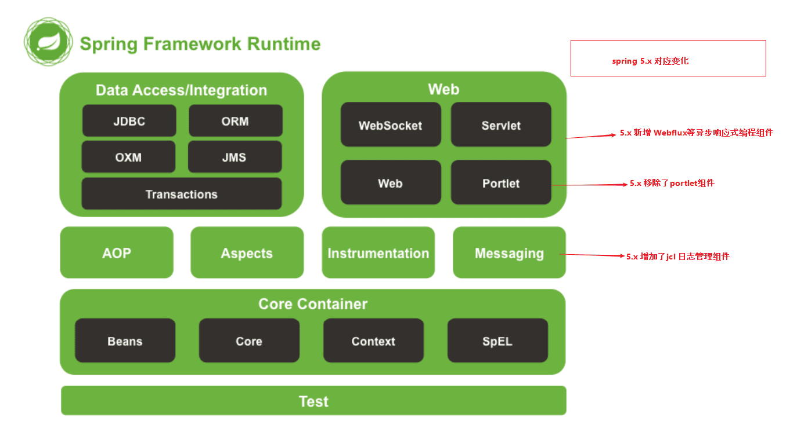

# Spring的架构

# IOC
控制反转，将对象的创建、调用、销毁等过程全部统一管理。那么在开发时如果用到了对象则只需向管理方申请对象，而后使用，无需自己创建。  
例如：在一个类Container中统一管理所有的对象。现在有dog类和cat类。那么在dog类需要cat类的对象时，需要向container索要cat对象。而不是直接new Cat()。那么对于dog类来说，对象的管理和控制都是Container类完成的，这就是控制反转。<font color=#fff010>依赖注入是控制反转的一种实现方式</font>  
<font color=#ff00f0>最大的优点是实现了松耦合，应用代码之间的不会因为某个细节的修改而进行全局修改</font>

# IOC的三种配置方式
* xml文件配置   
    ```xml
    <?xml version="1.0" encoding="UTF-8"?>
    <beans xmlns="http://www.springframework.org/schema/beans"
       xmlns:xsi="http://www.w3.org/2001/XMLSchema-instance"
       xsi:schemaLocation="http://www.springframework.org/schema/beans
        http://www.springframework.org/schema/beans/spring-beans.xsd">
    <!-- services -->
    <bean id="userService" class="tech.pdai.springframework.service.UserServiceImpl">
        <property name="userDao" ref="userDao"/>
        <!-- additional collaborators and configuration for this bean go here -->
    </bean>
    <!-- more bean definitions for services go here -->
    </beans>
* java config类进行配置  
    @bean指定创建实例的方法
    ```java
    @Configuration
    public class BeansConfig {
        /**
        * @return user dao
        */
        @Bean("userDao")
        public UserDaoImpl userDao() {
            return new UserDaoImpl();
        }

        /**
        * @return user service
        */
        @Bean("userService")
        public UserServiceImpl userService() {
            UserServiceImpl userService = new UserServiceImpl();
            userService.setUserDao(userDao());
            return userService;
        }
    }

* 注解配置
    @Contrller、@Service、@Repository
# 依赖注入的三种方式
* set注入
    通过对类实例变量设置get、set方法。xml配置中的\<property\>使用的就是set方式。在java和注解配置下直接在set方法写一个@Autowired注解
* 构造器注入  
    使用构造器进行注入。xml中配置/<contruct-arg/>就是指定构造器。java和注解配置下直接将构造器方法注解
* 注解注入 
  * @Autowired  
    默认使用byType模式，结合@Qualifier可以变为byName。作用范围Type、Field、Params、Constructor、AnnotationType
  * @Resource  
    这是java自带的注解。默认根据byName方式注解。作用范围Type、Field、Method
  * @Inject  
    同样java自带。默认使用byType方式注解。作用范围Constructor、Field、Method
# 源码分析IOC容器初始化
# 源码分析Bean实例化
