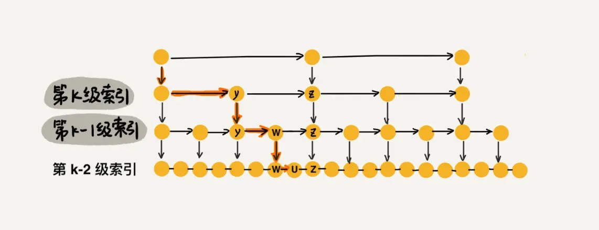

# B树是什么
 > 多路平衡搜索树，二叉搜索树是其特例，能够最大限度的降低树高，减小IO的次数。因为平衡二叉搜索树的节点只能存单个数据，B树的节点可以有多个。二叉树的搜索效率是最高的，B树是在IO次数与查询效率的折中 。

 m阶b树的定义
 * 每个节点最多只有m个子节点。
 * 每个非叶子节点（除了根）具有至少⌈ m/2⌉子节点。
 * 如果根不是叶节点，则根至少有两个子节点。
 * 具有k个子节点的非叶节点包含k -1个键。
 * 所有叶子都出现在同一水平，没有任何信息（高度一致）。

 插入靠分裂，删除靠人借。 
 # 跳表（skiplist）
 跳表的核心思想就是给链表建立多级索引，以便在o(logn)时间内查询链表。  

 ## 查询
  假设每两个结点建立一级索引，那么一共有o(logn)层的索引。由于每两个结点就会有一级索引，那么每级索引会排除1/2的节点。而每级节点最多遍历三次就能到达下一级索引。查询的复杂度就是3*logn = o(logn)
 
 ## 插入
 在插入时需要只需查找元素的位置然后插入链表即可，链表插入为o(1)，查找为o(logn)。因此插入也为o(logn)。然而，插入会有一个问题，即插入时需要更新索引，如果不更新索引那么极端情况就会退化成单链表。如果每次都将所有索引全部更新那么插入的复杂度就会变成o(n)。  
 因此跳表按概率建立索引，即每个节点都按一定的概率建立索引。极端情况是前n个节点每个都建立了索引，但这种情况概率很低。整体上索引不是均匀分布的，虽然比不上完全平均建立索引，但是对查询的影响比较小。当原始链表中元素数量足够大，且抽取足够随机的话，我们得到的索引是近似均匀的。  
建立索引的规则，实现一个randomlevel()方法:
* randomlevel()有1/2(可以设置为p以减少索引的空间复杂度)的概率返回1，此时该节点不建立索引
* randomlevel()有1/4的概率返回2，此时该节点建立一级索引
* randomlevel()有1/8的概率返回3，此时该节点建立而级索引
* 以此类推
由于建立k级索引时，0到k-1也会建立索引。因此，建立一级索引的概率就是当randomlevel()返回值大于1的所有情况之和。即1 - 1/2 = 1/2。同理，建立二级索引的概率为1 - 1/2 - 1/4 = 1/4。以此类推。


```java
private int randomLevel() {
int level = 1;
// 当 level < MAX_LEVEL，且随机数小于设定的晋升概率时，level + 1
while (Math.random() < SKIPLIST_P && level < MAX_LEVEL)
    level += 1;
return level;
}
```
因此插入最坏时间复杂度为o(logn)即每级索引都插入当前待插入的节点。
 ## 删除
 整体上与插入没有什么区别。不过多介绍。