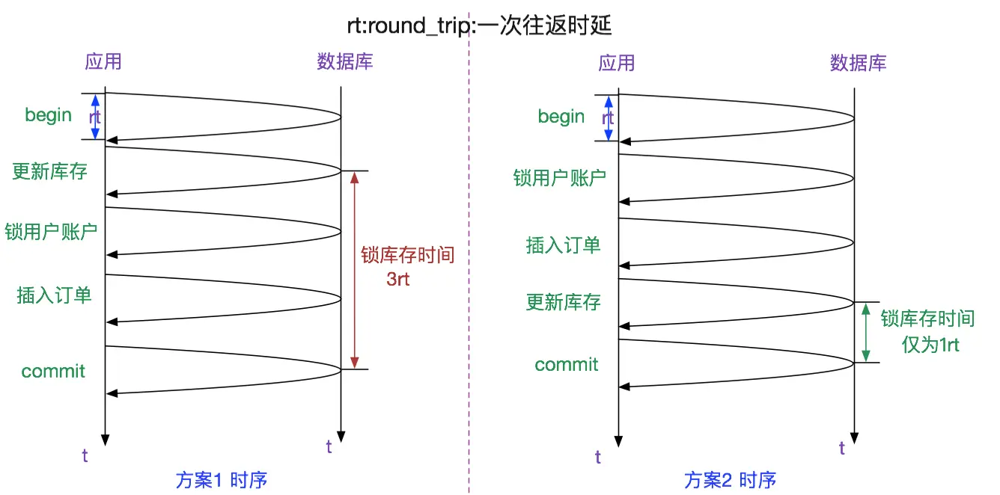
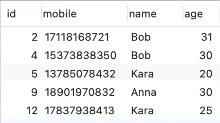

# 引擎
 * innoDB
   > 只有当需要innoDB不支持的特性是才需要其他引擎，否则默认都是这个

 * MyISAM
# 数据类型
* varchar(10)与varchar(200)存储相同的字符串时的区别
  > 在存储时没有区别，假设都存储“hello”那么消耗的存储空间是相同的，但是当进行排序查询等需要在内存进行的操作时不相同。因为当MySql创建临时表（SORT，ORDER等）时，VARCHAR会转换为CHAR，转换后的CHAR的长度就是varchar的长度，在内存中的空间就变大了，在排序、统计时候需要扫描的就越多，时间就越久。  
  并且varchar(10)与varchar(200)存储长度信息所需要的字节也不一样。
# 语法相关
## 零碎语法
* on 与where的区别
    > on 是确定连接的条件，决定了驱动表与被驱动表中的哪些行需要被组合，on的条件用在join的过程中。where是过滤结果的条件，在join完成的结果中，根据where的条件筛选符合的结果。

## 连表查询
### 内连接与外连接的区别是什么
* 内连接 
 
  被驱动表中没有则不会加入最终的结果中，相当于交集
  > select * from 驱动表, 被驱动表;  
    select * from 驱动表 join 被驱动表;  
    select * from 驱动表 inner join 被驱动表;
    select * from 驱动表 cross join 被驱动表;


* 外连接
   
    被驱动表中没有驱动表中有也会加入到最终的结果中，相当于并集
# 锁
## 两阶段锁协议
    > 将锁的使用分为加锁阶段和解锁阶段，mysql innoDB的引擎只有commit和rollback时才是解锁阶段，其他都是加锁阶段。因此，在一个事务中，需要锁多个⾏，要把最可能造成锁冲突、最可能影响并发度的锁尽量往后放。
   * 两阶段加锁对性能的影响  
    
     方案1 

     ```sql 
        begin;
        // 扣减库存
        update t_inventory 
        set count=count-5 
        where id=${id} and count >= 5;
        // 锁住用户账户表
        select * from t_user_account 
        where user_id=123 for update;
        // 插入订单记录
        insert into t_trans;
        commit;  
     ```
     方案2

     ```sql
        begin;
        // 锁住用户账户表
        select * from t_user_account 
        where user_id=123 for update;
        // 插入订单记录
        insert into t_trans;
        // 扣减库存
        update t_inventory 
        set count=count-5 
        where id=${id} and count >= 5;
        commit; 
     ```
由于在同一个事务之内，这几条对数据库的操作应该是等价的。但在两阶段加锁下的性能确是有比较大的差距。两者方案的时序如下图所示:



## MVCC并发版本控制(主要控制读写并发)
MySql中的mvcc实现。主要根据隐藏字段、版本链、一致性读视图三类数据实现
   * 隐藏字段
      > MySql记录里除了自定义的字段，还有系统自动生成的字段方便一些算法的实现。
      * row_id: 当没有自定义的主键时， 系统会自动生成一个主键
      * trx_id: 记录了增加/修改本记录行的事务ID，是系统自增的。
      * roll_pointer: 回滚指针，记录了当前记录的上一个版本。(在undo log中)
   * 版本链(redo log & undo log)
     * redo_log: 记录当前修改的内容，方便宕机后恢复
     * undo_log: 记录数据修改之前的内容，方便回滚和进行实现MVCC
   * 一致性读视图ReadView  

     主要包含四个数据
     * m_ids: 活跃事务列表当前系统中所有未提交的事务列表 
     * min_trx_id: 最小的活跃事务ID
     * next_trx_id: 生成 ReadView 时，系统给下一个新事务分配的ID,等于当前活跃事务ID的最大值+1。
     * creator_trx_id: 创建当前ReadVieW的事务ID
  
MySql中MVCC算法
 * 版本链中记录的 trx_id 等于当前事务ID  
  （trx_id = creator_trx_id）  
  说明记录是由当前事务修改的，对当前事务可见。
  * 版本链中记录的 trx_id 小于最小活跃事务ID  
  （trx_id < min_trx_id）  
  说明在创建ReadView之前，修改该记录的事务已经提交，对当前事务可见。
  
  * 版本链中记录的 trx_id 大于等于下一个事务ID  
  （trx_id > next_trx_id）  
  直接对当前事务不可见，这条规则主要应用于可重复读的隔离级别。
  * 当【版本链中记录的 trx_id 大于等于最小活跃事务id】且【版本链中记录的trx_id小于下一个要分配的事务id】  
  （min_trx_id<= trx_id < max_trx_id）  
  说明在创建ReadView时，当前记录被某个活跃的事务修改过。因此需要再查看活跃事务列表确定修改当前记录的事务是否已经提交了。如果记录的 trx_id在活跃事务id列表 m_ids 中说明，修改当前记录的事务还没提交，不可见。如果不在，则说明已经提交，可见。  

ReadView的创建根据不同隔离级别也不相同，因为MVCC主要是用来解决RC隔离级别下的脏读和RR隔离级别下的不可重复读的问题
 * 读已提交 每次都创建新的ReadView
 * 可重复读 只有事务中第一次读才创建ReadView，以后的读操作共用第一个ReadView。
## 行锁的加锁规则
InnoDB的行锁
 * 记录锁Record Lock  
    对单个行记录上锁
 * 间隙锁Gap Lock  
   * 对不包含真实存在记录的某一个间隙/范围加锁。
   * 间隙锁只有一个目的就是在RR、SERIALIZABLE隔离级别下为了防止其他事务插入数据。  
   * 假如一个索引有2、4、5、9、12 五个值，那该索引可能被间隙锁锁的范围为(-∞ , 2),(2 , 4),(4 , 5),(5 , 9),(9 , 12),(12 , +∞) 
 * 邻键锁Next-Key Lock   
    * 相当于Record Lock+Gap Lock，对【某一个行记录】和【这条记录与它前一条记录之间的范围/间隙】都上锁。
    * 假如一个索引有2、4、5、9、12 五个值，那该索引可能被邻键锁锁的范围为(-∞ , 2],(2 , 4],(4 , 5],(5 , 9],(9 , 12],(12 , +∞)。  


行锁加锁规则非常复杂。需要考虑索引类型，等值查询或范围查询，查询记录存在与否等几个因素。此外，InnoDB的锁是加在索引上的。

以下面的表为例


### 1.主键索引
  * 等值查询
    * 记录存在  
    select * from t_lock_test where id=5 for update  
    只会在id=5的记录上加记录锁

    * 记录不存在  
     select * from t_lock_test where id=7 for update  
    只此时会在7所在的范围加锁，也就是对id=9的记录加间隙锁
  * 范围查询
    * 记录存在(范围内有记录)  
    select * from t_lock_test where id>4 and id <8 for update  
    此时范围内有id=5的记录，会对5加临键锁,对8所在的范围加间隙锁。  
    select * from t_lock_test where id>4 and id <=9 for update  
    这时查询条件包括9,因此会对5、9都加临键锁。对比上条语句，上条语句实际上是9的临键锁退化为9的间隙锁。因为查询条件不包括9.
    * 记录不存在(范围内无记录)  
    select * from t_lock_test where id>5 and id <9 for update  
    在范围内加间隙锁，即(5, 9)

### 2.唯一索引
  * 等值查询
      * 记录存在  
      select * from t_lock_test where mobile='18901970832' for update  
      先在唯一索引idx_mobile上给mobile='18901970832’的记录加记录锁，再在主键索引上对对应的id=9的记录加记录锁。防止别的事务通过除了mobile之外的字段修改记录，因为当前的索引是唯一索引，最终都需要通过主键索引查询其他字段(回表), 如果不锁主键索引，其他并发事务就能够修改id=9的行数据。

      * 记录不存在  
      select * from t_lock_test where mobile='15933661689' for update  
      会在当前不存在的记录所在的范围加间隙锁，也就是对mobile='17118168721'加间隙锁(实际上是临键锁，但是由于查询条件不包括171，因此就变成了间隙锁)
  * 范围查询
      * 记录存在(范围内有记录)  
      select * from t_lock_test where mobile>'13931766909' and mobile<'17041965526' for update  
      在idx_mobile索引上给mobile='15373838350'和mobile='17118168721'的记录加邻键锁，并且因为mobile='15373838350'这条记录在查询范围内并且存在真实的记录，所以给这条记录对应在<font color=#008000>主键索引</font>的位置（id=4的记录）也加上了记录锁  
      <font color=#008000>注意这里有一个与规则不符的现象：给mobile='17118168721’的记录是加邻键锁而不是间隙锁</font>。这个现象没有找到好的解释，只能理解为mysql的设计问题。
      * 记录不存在(范围内无记录)  
      select * from t_lock_test where mobile>'13931766909' and mobile<'15101965526' for update  
      对mobile='15373838350’的记录加邻键锁，这里有同样的问题，正常理解应该加间隙锁，而实际上加了邻键锁。
### 3.非唯一索引

### 4.非索引     
这种情况只有一种处理方式，当查询条件为非索引时，无论是等值查询还是范围查询，无论是否存在查询结果，都会对表中所有的记录加邻键锁。
<font color=#128060>注意不是表锁，虽然效果上和表锁一致</font>
       
# 索引
## 类型
  1. 普通索引：最基本的索引，没有任何限制
  2. 唯⼀索引：与普通索引类似，但索引列的值必须是唯⼀的，允许空值
  3. 主键索引（聚簇索引）：⼀种特殊的唯⼀索引，⼀个表只能有⼀个主键，不允许有空值
  4. 组合索引：在多个字段上创建的索引，只有在查询条件中使⽤了创建索引的第⼀个字段，
  索引才会被使⽤
  5. 全⽂索引：主要⽤来查找⽂本中的关键字，类似于搜索引擎 
## 回表
普通索引只记录建立这个索引的字段和主键字段，具体数据行不会在索引中记录。而聚簇索引的叶⼦节点会直接记录数据行。因此当使用普通索引查询时，只能在普通索引得到建立索引的字段值和主键值，如果需要数据行其他的字段值就需要拿着主键再次查询（因为使用的是主键，因此会使用聚簇索引）得到数据行。这个过程就称为回表。
## 最左前缀匹配原则
在MySQL建立联合索引时会遵守最左前缀匹配原则，<font color=#128060>即最左优先，在检索数据时从联合索引的最左边开始匹配,且遇到范围查询(>、<、between、like)就会停止匹配。</font>  
结合B+树的数据结构理解,根据a,b字段创建的联合索引(a,b)

可以看到a的值是有顺序的，1，1，2，2，3，3，而b的值是没有顺序的1，2，1，4，1，2。但是我们又可发现a在等值的情况下，b值又是按顺序排列的，但是这种顺序是相对的。这是因为MySQL创建联合索引的规则是首先会对联合索引的最左边第一个字段排序，在第一个字段的排序基础上，然后在对第二个字段进行排序。所以b=2这种查询条件没有办法利用索引。
## 索引下推
索引下推（Index Condition Pushdown）是指 MySQL 在执行 SQL 查询时，会将 WHERE 子句中的条件下推到存储引擎层，尽可能地减少需要传输到 MySQL Server 层的数据量，从而提高查询性能。在使用索引下推时，MySQL 可以根据条件过滤掉不符合条件的记录，只将符合条件的记录传输到 MySQL Server 层，从而减少数据的传输量。

与最左匹配原则没有冲突，索引下推可以在满足最左匹配原则的情况下使用。最左匹配原则指的是，在使用联合索引（复合索引）时，如果查询条件包含了联合索引的左边部分，那么这个索引就可以被使用，否则将无法使用索引。索引下推并不会改变最左匹配原则，只是在使用索引时会更加智能，可以尽可能地利用索引来过滤不符合条件的记录。
## 覆盖索引
当sql语句的所求查询字段（select列）和查询条件字段（where子句）全都包含在一个索引中（联合索引），可以直接使用索引查询而不需要回表。这就是覆盖索引。  
<font color=#128060>select id from user_table where name= '张三' </font>  
name的索引包含了id值，因此不需要回表。  
<font color=#128060>select password from user_table where name= '张三' </font>     
如果有(name, password)的联合索引，那么这条语句也不需要回表。因此如果根据name查password的频次很高就可以建立联合索引优化查询。但如果频次比较低就没有必要单独建立联合索引。

## 数据结构
  1. B+树
  2. Hash表
  3. 有序数组
